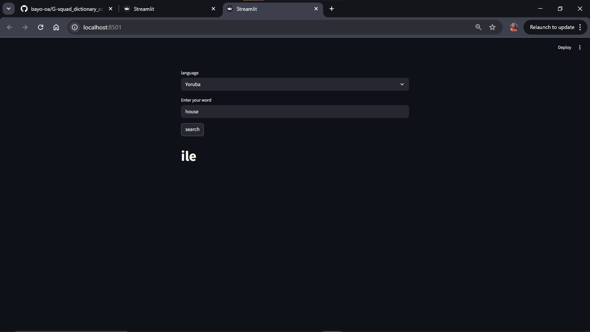

# 🇳🇬 Nigerian Language Dictionary App

## App Previews

A simple, interactive dictionary built with Streamlit that translates English words into several Nigerian languages, including Hausa, Yoruba, Igbo, Igala, and Idoma.

## Features
Multi-language Support: Choose between 5 different Nigerian languages.
Instant Search: Quickly find translations for common words like "house", "water", and "food".
User-Friendly Interface: Built with Streamlit for a clean, web-based experience.

## 🛠️ Technologies Used
Python
Streamlit (for the web interface)
